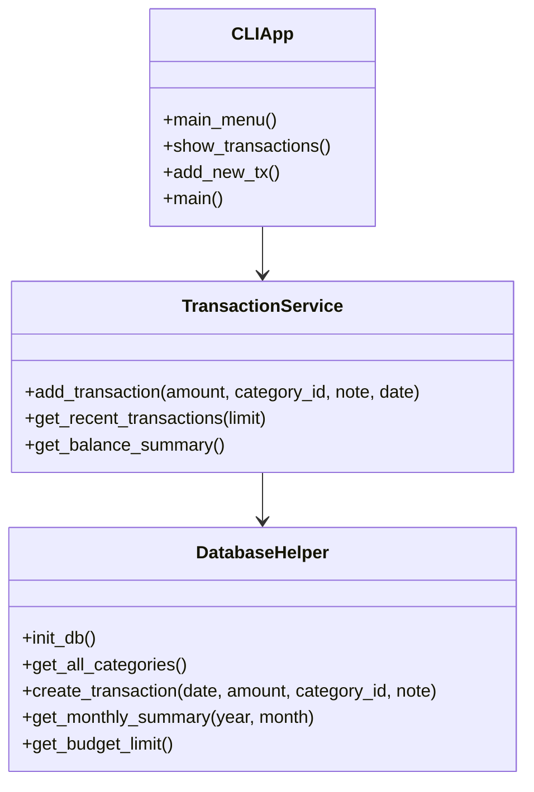
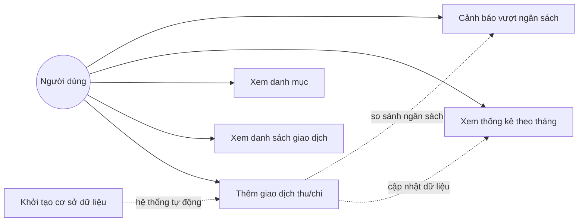

**BÁO CÁO BÀI TẬP LỚN**

**Đề 3: Hệ thống quản lý tài chính cá nhân**

**Giảng viên hướng dẫn: Hoàng Hồng Sơn**

**Nhóm thực hiện:**

- Phạm Quốc Khải - 725105095
- Phạm Thị Minh Châu - 725105026
---

## Lời cảm ơn

Nhóm chúng em xin chân thành cảm ơn giảng viên hướng dẫn đã tận tình giảng dạy, định hướng và hỗ trợ trong quá trình thực hiện bài tập lớn. Những góp ý chuyên môn của thầy/cô là cơ sở quan trọng giúp nhóm hoàn thiện đề tài đúng hướng và đạt được kết quả tốt hơn.

Nhóm cũng xin cảm ơn sự phối hợp của các thành viên trong quá trình tìm hiểu yêu cầu, xây dựng chương trình và hoàn thiện báo cáo. Do thời gian thực hiện còn hạn chế, báo cáo chắc chắn không tránh khỏi thiếu sót. Nhóm rất mong nhận được sự góp ý từ thầy/cô để có thể tiếp tục hoàn thiện hơn trong các giai đoạn sau.

## Phân công nhóm

- **Phạm Quốc Khải - 725105095:**
  - **Nhiệm vụ thực hiện:** Phụ trách phân tích bài toán, xây dựng nền tảng dữ liệu và hoàn thiện các chức năng xử lý giao dịch của hệ thống.
  - **Commit 1:** Khởi tạo dự án ban đầu, thiết lập cấu trúc tổng thể cho hệ thống quản lý tài chính cá nhân.
  - **Commit 2:** Phát triển các phương thức cốt lõi trong `db_helper.py`, bao gồm khởi tạo cơ sở dữ liệu, quản lý danh mục, thiết lập ngân sách, sao lưu, thống kê và khôi phục dữ liệu.
  - **Commit 3:** Xây dựng các phương thức xử lý giao dịch trong `transaction.py` và hoàn thiện giao diện dòng lệnh trong `main.py` nhằm hỗ trợ xem số dư, tra cứu lịch sử, thêm giao dịch và quản lý danh mục.
- **Phạm Thị Minh Châu - 725105026:**
  - **Nhiệm vụ thực hiện:** Phụ trách hoàn thiện giao diện trình bày, xây dựng phần demo và hỗ trợ tổng hợp báo cáo nhóm.
  - **Commit 1:** Bổ sung các chức năng kiểm tra số tiền đầu vào và hoàn thiện xử lý giao dịch cơ bản để hệ thống hoạt động ổn định.
  - **Commit 2:** Phát triển các chức năng thống kê theo tháng, cảnh báo vượt ngân sách và cải thiện menu, đồng thời chuẩn bị các dữ liệu minh họa phục vụ demo.
  - **Commit 3:** Hoàn thiện giao diện Flask, bao gồm các trang dashboard, danh mục, ngân sách, báo cáo và các thành phần tương tác bằng template, JavaScript và CSS.

## 1. Giới thiệu bài toán

Trong đời sống hằng ngày, việc quản lý thu nhập và chi tiêu cá nhân thường được thực hiện bằng cách ghi chép thủ công hoặc lưu trữ rời rạc trên nhiều thiết bị. Phương pháp này dễ dẫn đến thất lạc dữ liệu, khó tổng hợp tình hình tài chính và không hỗ trợ người dùng theo dõi dòng tiền một cách có hệ thống. Đối với sinh viên, việc kiểm soát các khoản chi sinh hoạt, học tập và phát sinh là đặc biệt cần thiết nhằm tránh vượt quá khả năng tài chính.

Xuất phát từ thực tiễn đó, nhóm chúng em xây dựng hệ thống quản lý tài chính cá nhân bằng Python. Ứng dụng cho phép ghi chép thu nhập và chi tiêu, phân loại giao dịch theo danh mục, theo dõi số dư hiện tại và lưu trữ dữ liệu cục bộ bằng SQLite. Mục tiêu của đề tài là hỗ trợ người dùng quản lý dòng tiền cá nhân một cách rõ ràng, thuận tiện và có khả năng mở rộng thêm các chức năng nâng cao trong các phiên bản tiếp theo.

## 2. Phân tích yêu cầu

### 2.1. Yêu cầu chức năng

Từ yêu cầu đề bài và phạm vi triển khai của nhóm, hệ thống cần đáp ứng các chức năng cơ bản sau:

- Ghi chép thu nhập và chi tiêu.
- Phân loại chi tiêu theo các nhóm như ăn uống, học tập, giải trí, di chuyển, hóa đơn, lương, thưởng.
- Thống kê tình hình tài chính theo tháng.
- Cảnh báo khi tổng chi tiêu vượt quá ngân sách đã thiết lập.

### 2.2. Yêu cầu phi chức năng

- Dữ liệu phải được lưu cục bộ và không bị mất sau khi thoát chương trình.
- Giao diện sử dụng cần đơn giản, dễ thao tác đối với người dùng phổ thông.
- Kiến trúc chương trình cần đảm bảo khả năng mở rộng để bổ sung biểu đồ, báo cáo chi tiết hoặc giao diện web trong tương lai.
- Mã nguồn phải tách biệt rõ ràng giữa phần giao diện, phần xử lý nghiệp vụ và phần truy cập dữ liệu để thuận tiện bảo trì.

### 2.3. Phạm vi hệ thống hiện tại

Phiên bản hiện tại của dự án được xây dựng theo mô hình CLI và sử dụng SQLite làm hệ quản trị cơ sở dữ liệu. Hệ thống đã triển khai các chức năng chính gồm: xem số dư hiện tại, xem lịch sử giao dịch, thêm giao dịch mới, xem danh sách danh mục và khởi tạo lại cơ sở dữ liệu. Bên cạnh đó, tầng xử lý dữ liệu đã được chuẩn bị sẵn các hàm thống kê theo tháng và thiết lập ngân sách nhằm phục vụ việc mở rộng sau này.

## 3. Thiết kế chương trình

### 3.1. Kiến trúc tổng quan

Chương trình được tổ chức theo mô hình module, gồm ba thành phần chính:

- `main.py`: đảm nhiệm hiển thị menu dòng lệnh và nhận tương tác từ người dùng.
- `modulo/transaction.py`: xử lý các nghiệp vụ liên quan đến giao dịch.
- `modulo/db_helper.py`: quản lý toàn bộ thao tác với cơ sở dữ liệu SQLite, bao gồm tạo bảng, truy vấn, cập nhật và thống kê.

Cách tổ chức này giúp phần giao diện không phải làm việc trực tiếp với câu lệnh SQL, từ đó tăng tính rõ ràng, dễ kiểm thử và dễ bảo trì cho hệ thống.

### 3.2. Thiết kế dữ liệu

Hệ thống sử dụng ba bảng dữ liệu chính trong SQLite:

- `categories`: lưu các danh mục giao dịch, bao gồm mã danh mục, tên hiển thị và loại giao dịch.
- `transactions`: lưu toàn bộ các giao dịch thu - chi với thông tin ngày, số tiền, danh mục và ghi chú.
- `settings`: lưu các cấu hình hệ thống, tiêu biểu là hạn mức ngân sách.

### 3.3. Mô hình lớp tương đương

Mặc dù chương trình hiện được xây dựng theo kiểu hàm và module, có thể quy chiếu sang mô hình lớp để trình bày UML như sau:

- `DatabaseHelper`
  - Nhiệm vụ: khởi tạo cơ sở dữ liệu, tạo kết nối, thực hiện thêm, sửa, xóa, thống kê và sao lưu dữ liệu.
  - Các hàm tiêu biểu: `init_db()`, `get_all_categories()`, `create_transaction()`, `get_monthly_summary()`, `get_budget_limit()`.

- `TransactionService`
  - Nhiệm vụ: xử lý nghiệp vụ giao dịch, tự động xác định số tiền dương đối với khoản thu và số tiền âm đối với khoản chi.
  - Các hàm tiêu biểu: `add_transaction()`, `get_recent_transactions()`, `get_balance_summary()`.

- `CLIApp`
  - Nhiệm vụ: hiển thị menu, thu nhận dữ liệu từ người dùng và gọi các hàm xử lý tương ứng.
  - Các hàm tiêu biểu: `main_menu()`, `show_transactions()`, `add_new_tx()`, `main()`.

Mô hình trên phản ánh mối quan hệ giữa giao diện người dùng, xử lý nghiệp vụ và lớp truy cập dữ liệu trong hệ thống.

### 3.4. Sơ đồ class

### 3.5. Sơ đồ use case

Tác nhân chính của hệ thống là người dùng. Từ góc nhìn chức năng, người dùng có thể thực hiện các thao tác sau:

- Khởi tạo cơ sở dữ liệu.
- Thêm giao dịch thu hoặc chi.
- Xem danh sách giao dịch.
- Xem danh mục giao dịch.
- Xem thống kê theo tháng.
- Nhận cảnh báo khi vượt ngân sách.

## 4. Mô tả các chức năng

### 4.1. Khởi tạo cơ sở dữ liệu

Khi chương trình được khởi chạy, hệ thống tự động kiểm tra và khởi tạo cơ sở dữ liệu nếu chưa tồn tại. Ba bảng `categories`, `transactions` và `settings` được tạo ra nhằm lưu trữ dữ liệu tài chính một cách có cấu trúc. Đồng thời, chương trình chèn sẵn một số danh mục mặc định như ăn uống, di chuyển, mua sắm, hóa đơn, lương và thưởng.

### 4.2. Ghi chép thu nhập và chi tiêu

Người dùng lựa chọn danh mục phù hợp, nhập số tiền và ghi chú nếu cần. Khi giao dịch được thêm vào hệ thống, chương trình sẽ tự động xác định dấu của số tiền dựa trên loại danh mục:

- Khoản thu được lưu dưới dạng số dương.
- Khoản chi được lưu dưới dạng số âm.

Cách xử lý này giúp việc tính tổng thu, tổng chi và số dư hiện tại trở nên thống nhất và chính xác hơn.

### 4.3. Phân loại giao dịch

Giao dịch được chia thành hai nhóm chính:

- Thu nhập: lương, thưởng.
- Chi tiêu: ăn uống, di chuyển, mua sắm, hóa đơn.

Việc phân loại theo danh mục giúp người dùng dễ dàng theo dõi cơ cấu sử dụng tiền và nhận biết các khoản chi chiếm tỷ trọng lớn.

### 4.4. Theo dõi số dư và lịch sử giao dịch

Màn hình chính hiển thị số dư hiện tại, tổng thu và tổng chi của người dùng. Ngoài ra, chương trình còn hỗ trợ xem danh sách giao dịch gần đây để kiểm tra nhanh các khoản phát sinh. Đây là chức năng quan trọng, giúp người dùng nắm bắt tình hình tài chính chỉ với vài thao tác đơn giản.

### 4.5. Thống kê theo tháng

Ở tầng xử lý dữ liệu, hệ thống đã được xây dựng hàm tổng hợp giao dịch theo tháng. Chức năng này cho phép tính:

- Tổng thu theo từng tháng.
- Tổng chi theo từng tháng.
- Số lượng giao dịch phát sinh trong tháng.

Từ đó, người dùng có thể so sánh xu hướng thu - chi giữa các tháng, nhận biết giai đoạn chi tiêu tăng cao và có kế hoạch điều chỉnh phù hợp.

### 4.6. Cảnh báo vượt ngân sách

Dữ liệu ngân sách được lưu trong bảng `settings`. Khi cần, hệ thống có thể lấy hạn mức ngân sách hiện tại và so sánh với tổng chi tiêu để phát hiện tình trạng vượt mức. Đây là một chức năng quan trọng đối với bài toán quản lý tài chính cá nhân vì giúp người dùng hạn chế chi tiêu quá khả năng kiểm soát.

## 5. Demo kết quả

Khi khởi chạy chương trình, giao diện dòng lệnh sẽ hiển thị số dư hiện tại cùng menu chức năng chính. Người dùng có thể thực hiện các thao tác sau:

- Xem danh sách giao dịch.
- Thêm giao dịch thu hoặc chi mới.
- Xem danh sách danh mục.
- Khởi tạo lại cơ sở dữ liệu khi cần làm mới dữ liệu.

Kịch bản demo có thể trình bày theo trình tự:

1. Khởi động chương trình, hệ thống tự động tạo cơ sở dữ liệu và các bảng cần thiết.
2. Thêm một khoản thu từ lương và một khoản chi cho ăn uống.
3. Kiểm tra lại lịch sử giao dịch để xác nhận số tiền được lưu đúng dấu dương và âm.
4. Quan sát số dư hiện tại sau khi cập nhật giao dịch.
5. Giới thiệu thêm các hàm thống kê theo tháng và cấu hình ngân sách ở tầng dữ liệu để chứng minh khả năng mở rộng của hệ thống.

Trong quá trình bảo vệ, nhóm có thể sử dụng màn hình CLI hoặc ảnh chụp các bước thao tác để minh họa cho phần demo của báo cáo.

## 6. Hướng phát triển thêm

Trong các giai đoạn tiếp theo, hệ thống có thể được mở rộng theo một số hướng sau:

- Nâng cấp từ giao diện dòng lệnh lên giao diện web để tăng tính trực quan.
- Bổ sung biểu đồ thống kê thu - chi theo ngày, tuần và tháng.
- Thêm chức năng xuất báo cáo ra Excel hoặc PDF.
- Xây dựng cơ chế phân quyền nếu hệ thống được sử dụng bởi nhiều tài khoản.
- Hoàn thiện cảnh báo ngân sách bằng thông báo trực tiếp khi giao dịch vượt mức quy định.
- Bổ sung kiểm thử tự động để nâng cao độ tin cậy của hệ thống.
