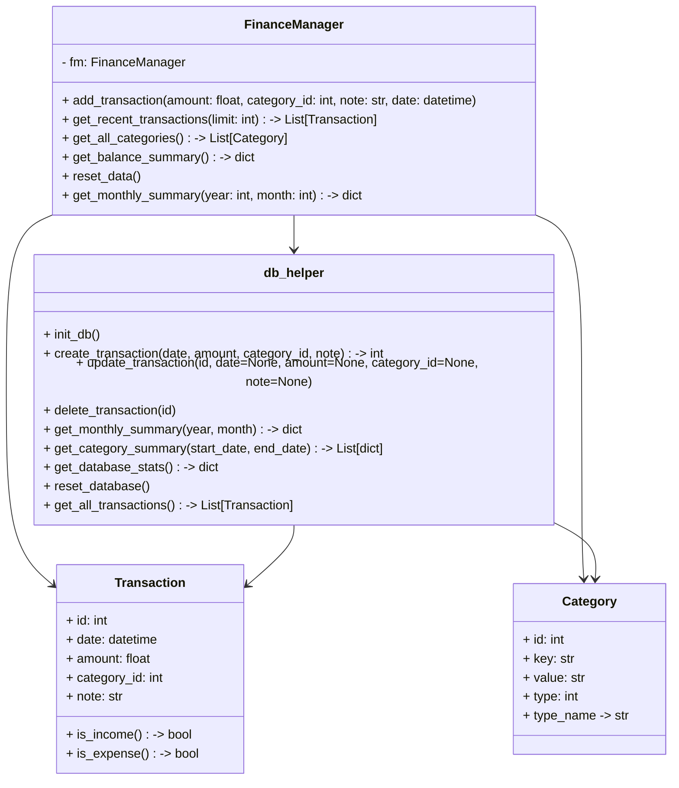
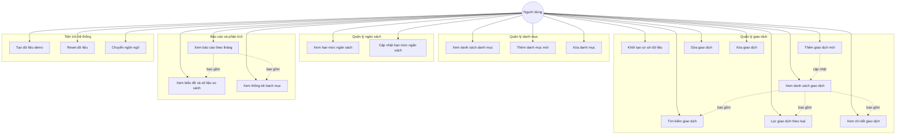

**BÁO CÁO BÀI TẬP LỚN**

**Đề 3: Hệ thống quản lý tài chính cá nhân**

**Giảng viên hướng dẫn: Hoàng Hồng Sơn**

**Nhóm thực hiện:**

- Phạm Quốc Khải - 725105095
- Phạm Thị Minh Châu - 725105026

---

## Lời cảm ơn

Nhóm chúng em xin chân thành cảm ơn giảng viên hướng dẫn đã tận tình giảng dạy, định hướng và hỗ trợ trong quá trình thực hiện bài tập lớn. Những góp ý chuyên môn của thầy/cô là cơ sở quan trọng giúp nhóm hoàn thiện đề tài đúng hướng và đạt được kết quả tốt hơn.

Nhóm cũng xin cảm ơn sự phối hợp của các thành viên trong quá trình tìm hiểu yêu cầu, xây dựng chương trình và hoàn thiện báo cáo. Do thời gian thực hiện còn hạn chế, báo cáo chắc chắn không tránh khỏi thiếu sót. Nhóm rất mong nhận được góp ý để tiếp tục hoàn thiện đề tài ở các giai đoạn sau.

## Phân công nhóm

- **Phạm Quốc Khải - 725105095**
  - **Nhiệm vụ:** Phụ trách phân tích bài toán, xây dựng tầng cơ sở dữ liệu, nghiệp vụ giao dịch và giao diện dòng lệnh.
  - **Commit 1:** Khởi tạo dự án ban đầu, thiết lập cấu trúc tổng thể cho hệ thống.
  - **Commit 2:** Phát triển các phương thức cốt lõi trong `db_helper.py` như khởi tạo cơ sở dữ liệu, quản lý danh mục, thiết lập ngân sách, sao lưu và thống kê.
  - **Commit 3:** Xây dựng các phương thức xử lý giao dịch trong `transaction.py` và hoàn thiện giao diện dòng lệnh trong `main.py` để xem số dư, tra cứu lịch sử, thêm giao dịch và quản lý danh mục.
  - **Commit 4:** Cải tiến cấu trúc chương trình theo hướng OOP và bổ sung kiểm thử đơn vị để nâng cao độ tin cậy.
  - **Commit 5:** Hoàn thiện UI/UX cho người dùng và tinh chỉnh các phần giao diện cuối cùng của dự án.

- **Phạm Thị Minh Châu - 725105026**
  - **Nhiệm vụ:** Phụ trách hoàn thiện giao diện Web Flask, phần biểu đồ báo cáo, phần trình bày và nội dung demo.
  - **Commit 1:** Bổ sung các chức năng kiểm tra số tiền đầu vào và hoàn thiện xử lý giao dịch cơ bản để hệ thống hoạt động ổn định.
  - **Commit 2:** Phát triển các chức năng thống kê theo tháng, cảnh báo vượt ngân sách và cải thiện menu, đồng thời chuẩn bị dữ liệu minh họa phục vụ demo.
  - **Commit 3:** Hoàn thiện giao diện Flask, bao gồm các trang dashboard, danh mục, ngân sách, báo cáo và các thành phần tương tác bằng template, JavaScript và CSS.
  - **Commit 4:** Tinh chỉnh giao diện, dashboard và các biểu đồ báo cáo để phần trình bày trực quan hơn.
  - **Commit 5:** Hoàn thiện trải nghiệm demo và nội dung thuyết trình, bảo đảm dữ liệu hiển thị rõ ràng khi bảo vệ.

## 1. Giới thiệu bài toán

Trong đời sống hằng ngày, việc quản lý thu nhập và chi tiêu cá nhân thường được ghi chép rời rạc hoặc lưu trong nhiều nơi khác nhau. Cách làm này dễ thất lạc dữ liệu, khó tổng hợp tình hình tài chính và không hỗ trợ theo dõi dòng tiền một cách có hệ thống. Với sinh viên hoặc người mới đi làm, việc kiểm soát các khoản chi sinh hoạt, học tập và phát sinh là rất cần thiết để tránh vượt quá khả năng tài chính.

Xuất phát từ thực tế đó, nhóm xây dựng hệ thống quản lý tài chính cá nhân bằng Python và SQLite. Ứng dụng cho phép ghi chép thu nhập, chi tiêu, phân loại giao dịch theo danh mục, theo dõi số dư hiện tại và lưu dữ liệu cục bộ. Bên cạnh giao diện dòng lệnh ban đầu, nhóm đã phát triển thêm giao diện Web Flask để trình bày trực quan hơn khi demo và sử dụng.

## 2. Phân tích yêu cầu

### 2.1. Yêu cầu chức năng

Hệ thống hiện tại đáp ứng các chức năng chính sau:

- Ghi chép giao dịch thu và chi.
- Phân loại giao dịch theo danh mục thu nhập và chi tiêu.
- Xem số dư hiện tại, tổng thu và tổng chi.
- Lọc, tìm kiếm, phân trang và xem chi tiết giao dịch.
- Sửa và xóa giao dịch.
- Quản lý danh mục thu - chi.
- Theo dõi và cập nhật hạn mức ngân sách.
- Xem báo cáo theo tháng với biểu đồ và số liệu so sánh.
- Tạo dữ liệu demo và thiết lập lại dữ liệu khi cần trình diễn.
- Chuyển ngôn ngữ giao diện giữa Tiếng Việt và English.

### 2.2. Yêu cầu phi chức năng

- Dữ liệu phải được lưu cục bộ và không bị mất sau khi thoát chương trình.
- Giao diện cần dễ thao tác khi chạy ở cả chế độ CLI và Web.
- Mã nguồn phải tách biệt giữa giao diện, nghiệp vụ và truy cập dữ liệu để thuận tiện bảo trì.
- Hệ thống cần đủ linh hoạt để mở rộng thêm chức năng thống kê và trình bày trong tương lai.

### 2.3. Phạm vi hệ thống hiện tại

Phiên bản hiện tại của dự án gồm hai lớp giao diện chạy trên cùng một cơ sở dữ liệu SQLite:

- Giao diện CLI trong `main.py` để thao tác nhanh từ dòng lệnh.
- Giao diện Web Flask trong `app.py` để trình bày dữ liệu bằng dashboard, bảng giao dịch, ngân sách và báo cáo.

Các chức năng đã hoàn thiện trong repository hiện tại gồm quản lý thu - chi, quản lý danh mục, theo dõi ngân sách, lọc và tìm kiếm giao dịch, sửa/xóa giao dịch, thống kê theo tháng, biểu đồ báo cáo, reset dữ liệu và tạo dữ liệu demo phục vụ trình bày.

## 3. Thiết kế chương trình

### 3.1. Kiến trúc tổng quan

Chương trình được tổ chức theo mô hình module, gồm các thành phần chính sau:

- `app.py`: chứa các route Flask, xử lý giao diện Web, lọc dữ liệu và hiển thị biểu đồ.
- `main.py`: hiển thị menu dòng lệnh và gọi các chức năng xử lý tương ứng.
- `modulo/transaction.py`: chứa lớp `FinanceManager` để xử lý nghiệp vụ giao dịch.
- `modulo/db_helper.py`: quản lý toàn bộ thao tác với SQLite như tạo bảng, truy vấn, cập nhật, thống kê, sao lưu và reset dữ liệu.
- `modulo/models.py`: định nghĩa các dataclass `Transaction` và `Category`.

Cách tổ chức này giúp phần giao diện không phải làm việc trực tiếp với câu lệnh SQL, từ đó tăng tính rõ ràng, dễ kiểm thử và dễ bảo trì.

### 3.2. Thiết kế dữ liệu

Hệ thống sử dụng ba bảng dữ liệu chính trong SQLite:

- `categories`: lưu danh mục giao dịch, gồm mã danh mục, tên hiển thị và loại thu/chi.
- `transactions`: lưu giao dịch với thông tin ngày, số tiền, danh mục và ghi chú.
- `settings`: lưu các cấu hình hệ thống, trong đó có hạn mức ngân sách mặc định.

Khi khởi tạo lần đầu, hệ thống tự tạo các danh mục mặc định như ăn uống, di chuyển, mua sắm, hóa đơn, lương và thưởng, đồng thời đặt hạn mức ngân sách mặc định là 5.000.000 VND.

### 3.3. Sơ đồ lớp (Class Diagram)

Chương trình được tổ chức theo các lớp (hoặc module + dataclass) với trách nhiệm rõ ràng:



**Mô tả các lớp:**

- **FinanceManager**: Lớp xử lý nghiệp vụ tài chính. Nó quản lý các giao dịch, tự động gán dấu số tiền dựa trên loại danh mục (dương cho thu, âm cho chi), và gọi các hàm trong `db_helper` để lưu/truy cập dữ liệu.

- **Transaction**: Dataclass biểu diễn một giao dịch với các thuộc tính: `id`, `date`, `amount`, `category_id`, `note`. Hỗ trợ các phương thức kiểm tra loại giao dịch.

- **Category**: Dataclass biểu diễn một danh mục. Hỗ trợ nhận biết loại thu (type=1) hoặc chi (type=0) thông qua thuộc tính `type_name`.

- **db_helper**: Module quản lý tất cả các thao tác với SQLite. Cung cấp các hàm khởi tạo cơ sở dữ liệu, CRUD giao dịch, thống kê theo tháng/danh mục, reset và sao lưu dữ liệu. Không có giao diện trực tiếp gọi SQL mà phải đi qua lớp này.

### 3.4. Sơ đồ trường hợp sử dụng (Use Case Diagram)

Hệ thống phục vụ một tác nhân chính là người dùng. Người dùng có thể thực hiện các trường hợp sử dụng sau:



**Giải thích các nhóm use case:**

1. **Quản lý giao dịch**: Bao gồm các thao tác CRUD (Create, Read, Update, Delete) trên giao dịch, từ thêm mới đến xem chi tiết, sửa và xóa. Xem danh sách là use case cha, bao gồm các use case con là tìm kiếm, lọc và xem chi tiết.

2. **Quản lý danh mục**: Cho phép người dùng xem các danh mục hiện có, thêm danh mục mới hoặc xóa danh mục không cần thiết.

3. **Quản lý ngân sách**: Người dùng có thể xem hạn mức hiện tại và cập nhật lại hạn mức khi cần.

4. **Báo cáo và phân tích**: Cho phép người dùng xem báo cáo theo tháng, biểu đồ xu hướng, so sánh với tháng trước và phân tích chi tiêu theo danh mục.

5. **Tiện ích hệ thống**: Bao gồm các chức năng hỗ trợ như tạo dữ liệu demo để trình diễn, reset dữ liệu khi cần làm mới, và chuyển đổi ngôn ngữ giao diện giữa Tiếng Việt và English.

## 4. Mô tả các chức năng

### 4.1. Khởi tạo cơ sở dữ liệu

Khi chương trình được khởi chạy, hệ thống tự động kiểm tra và khởi tạo cơ sở dữ liệu nếu chưa tồn tại. Ba bảng `categories`, `transactions` và `settings` được tạo ra để lưu trữ dữ liệu tài chính theo cấu trúc rõ ràng. Đồng thời, hệ thống chèn sẵn các danh mục mặc định để người dùng có thể sử dụng ngay.

### 4.2. Ghi chép thu nhập và chi tiêu

Người dùng nhập số tiền, chọn danh mục, ghi chú và thời gian giao dịch. Khi giao dịch được lưu, lớp `FinanceManager` sẽ tự động xác định dấu của số tiền dựa trên loại danh mục:

- Khoản thu được lưu dưới dạng số dương.
- Khoản chi được lưu dưới dạng số âm.

Cách xử lý này giúp việc tính tổng thu, tổng chi và số dư hiện tại nhất quán hơn trong toàn hệ thống.

### 4.3. Quản lý giao diện dòng lệnh

`main.py` đóng vai trò là giao diện CLI cơ bản. Tại đây người dùng có thể xem số dư nhanh, xem giao dịch gần đây, thêm giao dịch mới, xem danh sách categories và reset dữ liệu. CLI được giữ ở mức gọn nhẹ để phù hợp với thao tác nhanh và kiểm tra dữ liệu tức thời.

### 4.4. Giao diện Web Flask

Giao diện Web là phần được mở rộng thêm để phục vụ trình bày trực quan. Hệ thống hiện có các trang chính:

- Dashboard: hiển thị số dư, tổng thu, tổng chi, ngân sách còn lại và biểu đồ tổng quan.
- Giao dịch: hiển thị bảng giao dịch, tìm kiếm, lọc theo loại, phân trang, thêm mới, xem chi tiết, sửa và xóa.
- Danh mục: hiển thị danh mục thu và chi tách riêng, cho phép thêm và xóa danh mục.
- Ngân sách: hiển thị mức sử dụng ngân sách và cho phép cập nhật hạn mức.
- Báo cáo: hiển thị báo cáo theo tháng, so sánh với tháng trước, biểu đồ ngày, biểu đồ cơ cấu danh mục và xu hướng 6 tháng gần đây.

Ngoài ra, giao diện có hỗ trợ chuyển ngôn ngữ giữa Tiếng Việt và English, giúp phần demo linh hoạt hơn.

### 4.5. Theo dõi số dư và lịch sử giao dịch

Màn hình chính hiển thị số dư hiện tại, tổng thu, tổng chi và tình trạng ngân sách. Ở trang giao dịch, người dùng có thể tra cứu lịch sử phát sinh gần đây, tìm theo danh mục hoặc ghi chú và chuyển qua lại giữa các loại giao dịch. Đây là chức năng quan trọng để nắm bắt tình hình tài chính chỉ với vài thao tác.

### 4.6. Thống kê theo tháng

Tầng xử lý dữ liệu đã được xây dựng hàm tổng hợp giao dịch theo tháng. Chức năng này cho phép tính:

- Tổng thu theo từng tháng.
- Tổng chi theo từng tháng.
- Số lượng giao dịch phát sinh trong tháng.

Từ đó, người dùng có thể so sánh xu hướng thu - chi giữa các tháng và nhận biết giai đoạn chi tiêu tăng cao để điều chỉnh phù hợp.

### 4.7. Cảnh báo và cập nhật ngân sách

Dữ liệu ngân sách được lưu trong bảng `settings`. Trang ngân sách cho phép xem hạn mức hiện tại, số tiền đã chi trong tháng và số tiền còn lại. Khi mức sử dụng cao, giao diện sẽ thể hiện trạng thái cảnh báo để người dùng dễ theo dõi và điều chỉnh kế hoạch chi tiêu.

### 4.8. Tạo dữ liệu demo và reset dữ liệu

Hệ thống có sẵn chức năng reset dữ liệu và tạo dữ liệu demo để phục vụ trình diễn. Khi tạo demo, chương trình sẽ xóa dữ liệu cũ, sinh tập giao dịch mẫu theo nhiều tháng gần đây và hiển thị lại các biểu đồ, số liệu tổng hợp. Chức năng này giúp buổi bảo vệ có dữ liệu trực quan mà không cần nhập thủ công nhiều lần.

## 5. Demo kết quả

Để buổi bảo vệ trực quan hơn, nhóm sử dụng giao diện Web Flask làm kênh trình bày chính, đồng thời vẫn giữ CLI để chứng minh kiến trúc tách lớp và khả năng tái sử dụng nghiệp vụ.

### 5.1. Kịch bản demo đề xuất (Web)

1. Mở trang Dashboard để trình bày số dư hiện tại, tổng thu, tổng chi và các thẻ thống kê tổng quan.
2. Chuyển sang trang Giao dịch và thêm mới một giao dịch thu, một giao dịch chi.
3. Thực hiện tìm kiếm và lọc giao dịch theo loại để chứng minh khả năng truy xuất dữ liệu nhanh.
4. Sửa một giao dịch đã tạo và xóa một giao dịch mẫu để minh họa vòng đời CRUD.
5. Mở trang Danh mục để thêm hoặc xóa danh mục, chứng minh tính linh hoạt của phân loại dữ liệu.
6. Mở trang Ngân sách để cập nhật hạn mức và quan sát tỷ lệ sử dụng.
7. Mở trang Báo cáo để trình bày:
   - So sánh kỳ hiện tại với kỳ trước.
   - Biểu đồ xu hướng thu - chi theo ngày.
   - Biểu đồ so sánh tháng.
   - Phân bổ chi tiêu theo danh mục.
   - Xu hướng 6 tháng gần đây.
8. Dùng chức năng tạo dữ liệu demo khi cần tái lập dữ liệu trình diễn.

### 5.2. Kịch bản demo bổ sung (CLI)

1. Chạy `main.py` để hiển thị menu chính và số dư hiện tại.
2. Thêm giao dịch từ CLI để chứng minh cùng một nghiệp vụ `FinanceManager` vẫn hoạt động ổn định.
3. Quay lại Web và tải lại trang để xác nhận dữ liệu được lấy từ cùng một cơ sở dữ liệu SQLite.

Kịch bản kết hợp Web + CLI giúp thể hiện rõ tính nhất quán nghiệp vụ và khả năng mở rộng giao diện của hệ thống.

## 6. Hướng phát triển thêm

Trong các giai đoạn tiếp theo, hệ thống có thể được mở rộng theo một số hướng sau:

- Thêm biểu đồ thống kê theo tuần và theo năm.
- Hoàn thiện cảnh báo ngân sách bằng thông báo trực tiếp khi giao dịch vượt mức.
- Bổ sung kiểm thử tự động để nâng cao độ tin cậy của hệ thống.
- Phát triển thêm khả năng sao lưu và khôi phục dữ liệu từ giao diện người dùng.

## 7. Minh chứng từ mã nguồn

Để tránh mô tả vượt quá những gì đã làm, phần này trích đúng các đoạn mã đang có trong repository để làm minh chứng cho các chức năng đã triển khai.

### 7.1. Tự động gán dấu cho giao dịch thu - chi

```python
def add_transaction(self, amount: float, category_id: int, note: Optional[str] = None, date: Optional[str] = None) -> int:
  """Thêm giao dịch mới, tự động xử lý dấu âm/dương dựa trên loại danh mục."""
  categories = self.get_all_categories()
  category = next((c for c in categories if c.id == category_id), None)

  if not category:
    raise ValueError(f"Category với ID {category_id} không tồn tại.")

  final_amount = abs(amount) if category.type == 1 else -abs(amount)

  transaction = Transaction.create_new(final_amount, category_id, note)
  if date:
    transaction.date = date

  return db_helper.create_transaction(
    transaction.date,
    transaction.amount,
    transaction.category_id,
    transaction.note
  )
```

### 7.2. Route thêm giao dịch, cập nhật ngân sách, reset dữ liệu và tạo demo

```python
def add_transaction() -> str:
  category_id = request.form.get("category_id", type=int)
  amount = request.form.get("amount", type=float)
  note = request.form.get("note", default="").strip() or None
  date_value = _parse_datetime_local(request.form.get("date"))

  if category_id is None or amount is None or amount <= 0:
    flash("Vui lòng nhập số tiền hợp lệ lớn hơn 0 và chọn danh mục.", "error")
    return redirect(url_for("transactions_page"))
```

```python
def update_budget() -> str:
  budget_value = request.form.get("budget_limit", type=float)
  if budget_value is None or budget_value <= 0:
    flash("Ngân sách phải lớn hơn 0.", "error")
    return redirect(url_for("budget_page"))

  db_helper.set_budget_limit(budget_value)
  flash("Đã cập nhật hạn mức ngân sách.", "success")
  return redirect(url_for("budget_page"))
```

```python
def reset_database() -> str:
  db_helper.reset_database()
  app.config["DATABASE_READY"] = True
  flash("Đã khởi tạo lại cơ sở dữ liệu.", "success")
  return redirect(url_for("dashboard"))


def create_demo_data() -> str:
  db_helper.reset_database()
  app.config["DATABASE_READY"] = True
  created, message = _seed_demo_transactions()
  flash(message if created else "Không tạo được dữ liệu demo.", "success" if created else "error")
  return redirect(url_for("dashboard"))
```

### 7.3. Tạo bảng và thống kê dữ liệu từ SQLite

```python
def init_db():
  """Khởi tạo các bảng dữ liệu lần đầu."""
  conn = get_connection()
  cursor = conn.cursor()

  cursor.execute('''
    CREATE TABLE IF NOT EXISTS categories (
      id INTEGER PRIMARY KEY AUTOINCREMENT,
      key TEXT UNIQUE NOT NULL,
      value TEXT NOT NULL,
      type INTEGER NOT NULL CHECK (type IN (0, 1)) -- 0: chi, 1: thu
    )
           ''')
```

```python
def get_monthly_summary(year=None, month=None):
  """Lấy tổng kết theo tháng."""
  conn = get_connection()
  cursor = conn.cursor()

  cursor.execute('''
    SELECT
      strftime('%Y-%m', date) as month,
      SUM(CASE WHEN amount > 0 THEN amount ELSE 0 END) as total_income,
      SUM(CASE WHEN amount < 0 THEN amount ELSE 0 END) as total_expense,
      COUNT(*) as transaction_count
    FROM transactions
    WHERE date LIKE ?
    GROUP BY strftime('%Y-%m', date)
    ORDER BY month DESC
  ''', (date_pattern,))
```

```python
def create_transaction(date, amount, category_id, note=None):
  """Tạo giao dịch mới."""
  conn = get_connection()
  cursor = conn.cursor()

  cursor.execute('''
    INSERT INTO transactions (date, amount, category_id, note)
    VALUES (?, ?, ?, ?)
  ''', (date, amount, category_id, note))
```

### 7.4. Giao diện CLI và đổi ngôn ngữ

```python
def main_menu(manager: FinanceManager):
  print("\n=== QUẢN LÝ TÀI CHÍNH CÁ NHÂN ===")
  stats = manager.get_balance_summary()
  print(f"Số dư hiện tại: {stats['current_balance']:,.0f} VND")
  print(f"(Tổng Thu: {stats['total_income']:,.0f} | Tổng Chi: {abs(stats['total_expense']):,.0f})")
```

```python
@app.route("/language", methods=["POST"])
def set_language() -> str:
  language = request.form.get("language", "vi")
  session["language"] = language if language in TRANSLATIONS else "vi"
  return redirect(request.referrer or url_for("dashboard"))
```

## 8. Kiểm thử và đánh giá

### 8.1. Kiểm thử đã thực hiện

Trong repository hiện tại chưa có bộ kiểm thử tự động đầy đủ. Các chức năng chính được kiểm tra thủ công qua hai giao diện CLI và Web, tập trung vào các luồng:

- Khởi tạo và reset dữ liệu.
- Thêm giao dịch thu và chi.
- Tìm kiếm, lọc, phân trang, sửa và xóa giao dịch.
- Thêm và xóa danh mục.
- Cập nhật ngân sách.
- Chọn tháng báo cáo và quan sát biểu đồ.
- Tạo dữ liệu demo để trình bày.

### 8.2. Cách chạy hệ thống

1. Cài thư viện:
   - `pip install -r requirements.txt`
2. Chạy Web Flask:
   - `python app.py`
   - Truy cập `http://127.0.0.1:5000`
3. Chạy CLI:
   - `python main.py`

### 8.3. Đánh giá kết quả

- Hệ thống đáp ứng đầy đủ nhóm chức năng trọng tâm của đề tài: ghi chép, phân loại, theo dõi ngân sách và báo cáo tài chính.
- Dữ liệu lưu trữ cục bộ bằng SQLite nên không bị mất khi thoát chương trình.
- Tổ chức theo module giúp mã nguồn rõ ràng và thuận tiện mở rộng.
- Giao diện Flask giúp phần demo trực quan hơn, phù hợp cho thuyết trình bảo vệ.

## 9. Kết luận

Nhóm đã xây dựng hệ thống quản lý tài chính cá nhân trên nền tảng Python + SQLite với hai giao diện là CLI và Web Flask. Ứng dụng đáp ứng tốt yêu cầu bài toán thực tế: theo dõi thu - chi, quản lý danh mục, kiểm soát ngân sách, xem báo cáo theo tháng và trình bày dữ liệu trực quan.

Thông qua quá trình thực hiện, nhóm rút ra được kinh nghiệm về phân tách tầng dữ liệu - nghiệp vụ - giao diện, tổ chức module và trình bày báo cáo theo hướng bám sát chức năng thực tế của hệ thống. Đây là nền tảng tốt để tiếp tục mở rộng sang các tính năng nâng cao trong các phiên bản tiếp theo.
