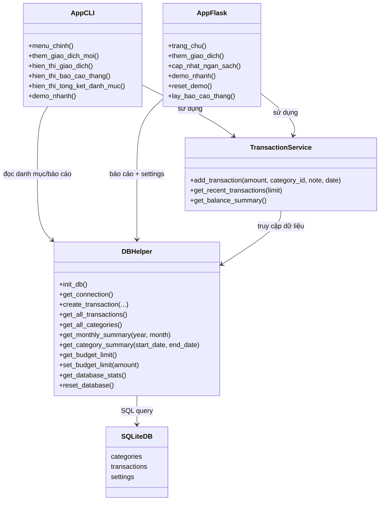

# BÁO CÁO THUYẾT TRÌNH BÀI TẬP LỚN

## Đề tài
Hệ thống quản lý tài chính cá nhân (Personal Money Manager)

## 1. Giới thiệu bài toán
Trong thực tế, nhiều sinh viên và người đi làm gặp khó khăn khi theo dõi thu nhập - chi tiêu hằng ngày. Việc chi tiêu không được ghi chép đầy đủ sẽ dẫn đến:
- Không biết tiền đang được dùng vào nhóm nào.
- Không đánh giá được mức chi theo tháng có vượt kế hoạch hay không.
- Không có cảnh báo sớm để điều chỉnh hành vi tài chính.

Từ bài toán trên, nhóm xây dựng hệ thống quản lý tài chính cá nhân, cho phép:
- Ghi nhận giao dịch Thu/Chi.
- Phân loại giao dịch theo danh mục.
- Tổng hợp báo cáo theo tháng.
- Cảnh báo vượt hạn mức ngân sách.

Hệ thống được triển khai theo 2 cách sử dụng:
- Bản CLI (menu dòng lệnh) để học và kiểm thử logic.
- Bản Web Flask để demo trực quan trên trình duyệt.

## 2. Phân tích yêu cầu
### 2.1 Yêu cầu chức năng
1. Quản lý giao dịch:
- Thêm giao dịch mới với số tiền, danh mục, ghi chú, thời gian.
- Tự động xử lý dấu tiền theo loại danh mục:
  - Thu: số dương.
  - Chi: số âm.

2. Quản lý danh mục:
- Có sẵn danh mục mặc định Thu và Chi.
- Lấy danh sách danh mục để người dùng chọn khi nhập giao dịch.

3. Thống kê tổng quan:
- Tổng Thu, Tổng Chi, Số dư hiện tại.
- Số lượng giao dịch.

4. Báo cáo theo tháng:
- Lọc theo năm/tháng.
- Hiển thị Tổng Thu, Tổng Chi, Số dư, Số lượng giao dịch.

5. Quản lý ngân sách:
- Lưu giá trị budget_limit trong bảng settings.
- Cảnh báo khi Tổng Chi tháng > budget_limit.

6. Tổng kết theo danh mục:
- Số giao dịch mỗi danh mục.
- Tổng tiền theo từng danh mục.

7. Hỗ trợ demo nhanh:
- Tạo dữ liệu mẫu ngẫu nhiên để trình bày nhanh trên lớp.
- Reset dữ liệu demo về trạng thái ban đầu.

### 2.2 Yêu cầu phi chức năng
- Dễ cài đặt: dùng SQLite, không cần server database riêng.
- Dễ sử dụng: giao diện rõ ràng (CLI và Web).
- Ổn định: có kiểm tra dữ liệu đầu vào (số tiền > 0, danh mục hợp lệ).
- Mở rộng: tách lớp xử lý CSDL và nghiệp vụ để nâng cấp về sau.

## 3. Thiết kế chương trình (UML / sơ đồ class)
### 3.1 Kiến trúc tổng quan
Hệ thống được tách thành 3 lớp:
- Presentation layer: main.py (CLI), app_flask.py + templates/index.html (Web).
- Business layer: modulo/transaction.py.
- Data Access layer: modulo/db_helper.py + SQLite finance.db.

### 3.2 UML class diagram (mô phỏng)

### 3.3 Luồng xử lý chính
1. Người dùng nhập giao dịch (CLI/Web).
2. Service kiểm tra category và chuẩn hóa dấu số tiền.
3. DBHelper ghi vào bảng transactions.
4. Dashboard và báo cáo đọc lại dữ liệu từ database để tổng hợp.

## 4. Mô tả các chức năng
### 4.1 Chức năng ghi chép Thu/Chi
- Người dùng chọn danh mục và nhập số tiền.
- Hệ thống validate dữ liệu đầu vào.
- Tự động quy đổi dấu số tiền theo loại danh mục để tránh sai logic.
- Lưu giao dịch vào CSDL kèm ghi chú/thời gian.

### 4.2 Chức năng xem lịch sử giao dịch
- Hiển thị danh sách giao dịch mới nhất.
- Có các thông tin: ngày giờ, loại, danh mục, số tiền, ghi chú.

### 4.3 Chức năng thống kê tổng quan
- Tổng hợp Tổng Thu, Tổng Chi, Số dư hiện tại.
- Hiển thị ngay trên menu/dashboard để người dùng nắm tình hình nhanh.

### 4.4 Chức năng báo cáo theo tháng và cảnh báo ngân sách
- Người dùng nhập năm/tháng.
- Hệ thống tổng hợp số liệu theo tháng từ bảng transactions.
- So sánh Tổng Chi với hạn mức budget_limit.
- Nếu vượt sẽ thông báo cảnh báo kèm số tiền vượt.

### 4.5 Chức năng tổng kết theo danh mục
- Gom nhóm theo danh mục.
- Đếm số giao dịch và tổng số tiền từng danh mục.
- In thêm Tổng THU và Tổng CHI để tổng quan.

### 4.6 Chức năng demo nhanh
- Tự động tạo dữ liệu mẫu để trình bày trên lớp.
- Có trường hợp không vượt và vượt hạn mức để chứng minh cảnh báo.
- Có reset demo để chạy lại từ đầu.

## 5. Demo kết quả
### 5.1 Kịch bản demo đề nghị (2-3 phút)
1. Mở hệ thống, giới thiệu mục tiêu đề tài.
2. Bấm tạo dữ liệu demo nhanh.
3. Mở lịch sử giao dịch để cho thấy Thu/Chi đã được ghi nhận.
4. Mở thống kê theo tháng để cho thấy Tổng Thu, Tổng Chi, Số dư.
5. Giảm hạn mức ngân sách và tạo dữ liệu chi lớn để kích hoạt cảnh báo vượt ngân sách.
6. Mở tổng kết theo danh mục để cho thấy phân bổ chi tiêu.
7. Kết luận: hệ thống đáp ứng đầy đủ yêu cầu đề tài.

### 5.2 Kết quả đạt được
- Hoàn thành đầy đủ 4 yêu cầu cốt lõi: ghi chép thu chi, danh mục, thống kê tháng, cảnh báo ngân sách.
- Hệ thống chạy ổn định ở chế độ CLI và Web.
- Dữ liệu được lưu bền vững bằng SQLite.
- Có tính năng hỗ trợ demo nhanh để bảo vệ trước lớp.

## 6. Hướng phát triển thêm
1. Thêm đăng nhập, phân quyền nhiều người dùng.
2. Thêm biểu đồ trực quan (cột, tròn, đường).
3. Thêm bộ lọc nâng cao theo khoảng ngày, theo từ khóa ghi chú.
4. Xuất báo cáo PDF/Excel.
5. Đồng bộ cloud và bản mobile.
6. Gợi ý tối ưu chi tiêu dựa trên lịch sử.

## 7. Phần làm trong bài (để trả lời khi thầy hỏi)
Bạn có thể trình bày ngắn gọn như sau:
- Em phụ trách xử lý nghiệp vụ giao dịch trong service:
  - Tự động xử lý dấu âm/dương cho Thu và Chi.
  - Kiểm tra danh mục hợp lệ trước khi lưu.
- Em phụ trách thống kê:
  - Báo cáo theo tháng (Tổng Thu, Tổng Chi, Số dư, Số giao dịch).
  - Cảnh báo vượt ngân sách dựa trên budget_limit.
  - Tổng kết theo danh mục.
- Em phụ trách demo:
  - Chức năng tạo dữ liệu mẫu nhanh.
  - Chuẩn bị kịch bản demo 2-3 phút.

Nếu thầy hỏi về kỹ thuật, có thể trả lời:
- Tại sao dùng SQLite? Vì gọn nhẹ, không cần cài server, phù hợp bài tập lớn.
- Tại sao tách transaction.py và db_helper.py? Để tách nghiệp vụ và truy cập dữ liệu, dễ bảo trì và mở rộng.
- Cảnh báo ngân sách tính thế nào? Lấy Tổng Chi tháng so với budget_limit; nếu vượt thì hiện số tiền vượt.

## 8. Kết luận
Đề tài đã được triển khai đúng trọng tâm của học phần hướng đối tượng và quản lý dữ liệu:
- Có phân tách module rõ ràng.
- Có CSDL lưu trữ bền vững.
- Có thống kê và cảnh báo có ý nghĩa thực tế.

Hệ thống có thể tiếp tục nâng cấp thành sản phẩm ứng dụng thực tế nếu bổ sung xác thực, biểu đồ, đồng bộ dữ liệu và ứng dụng mobile.
